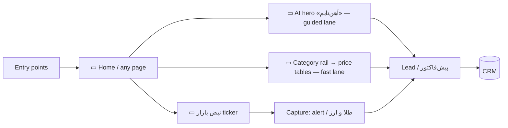
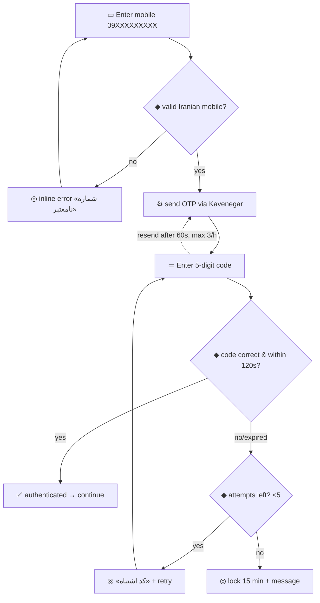
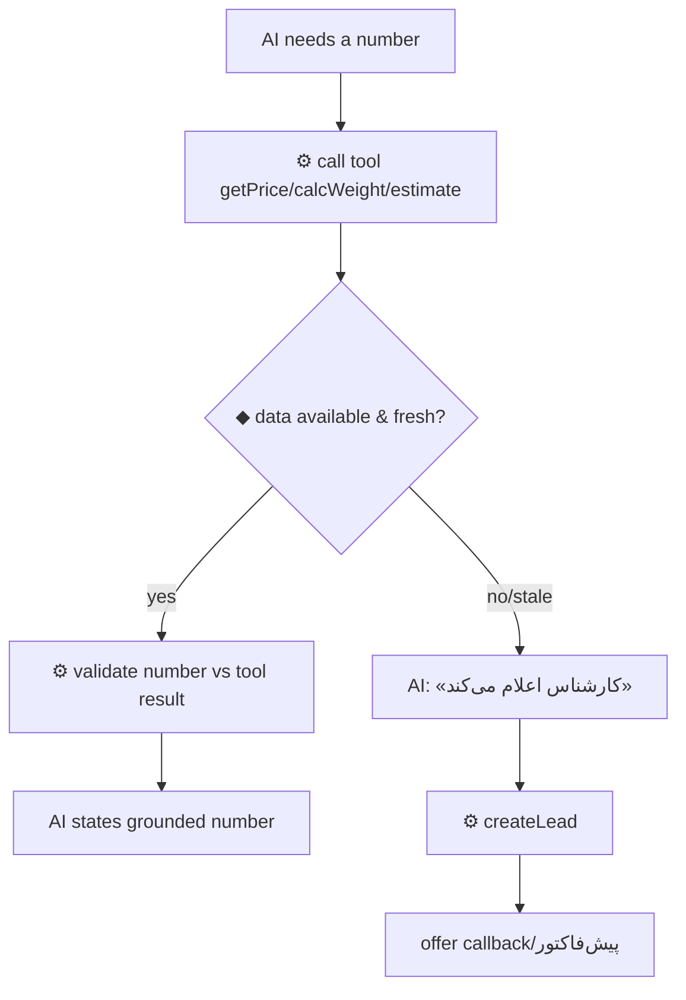
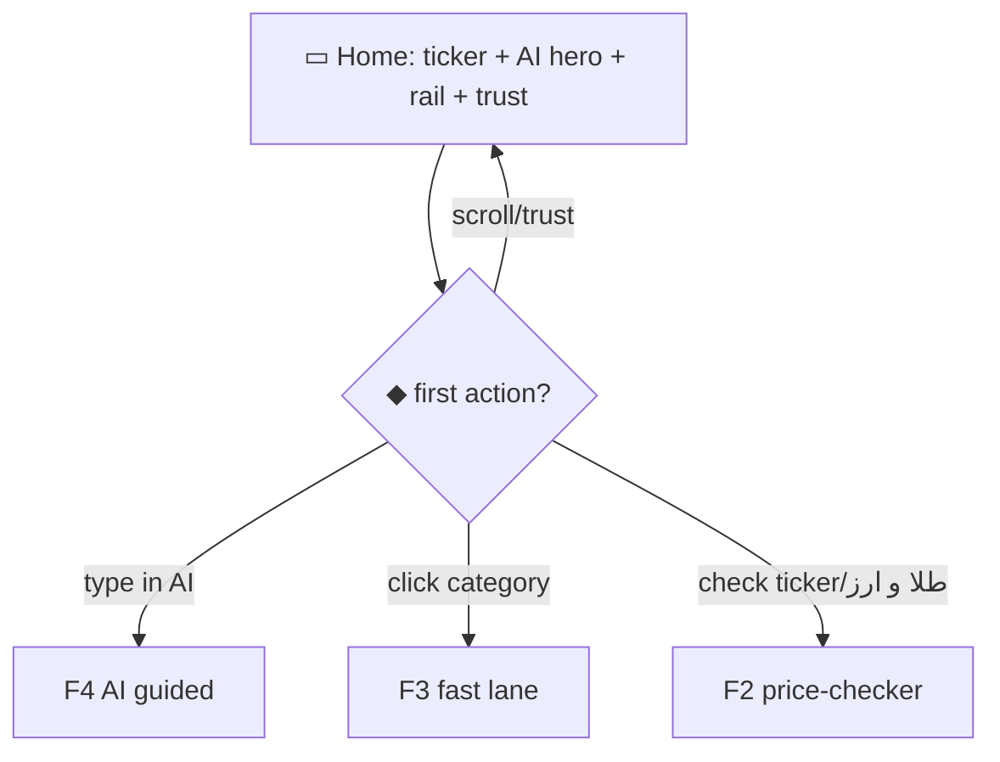
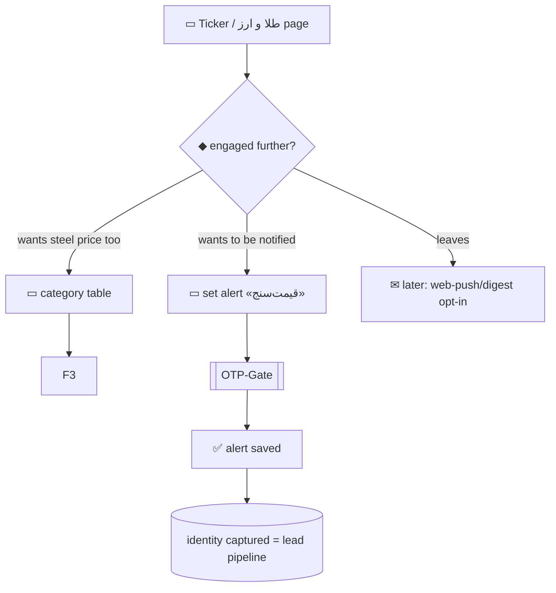
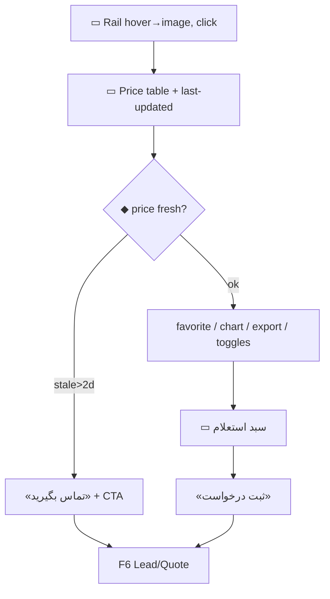
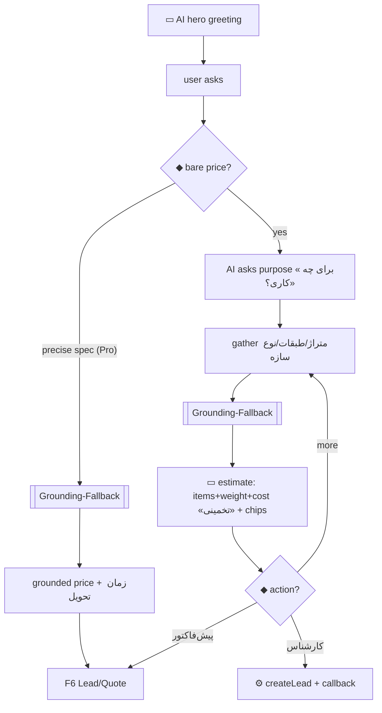
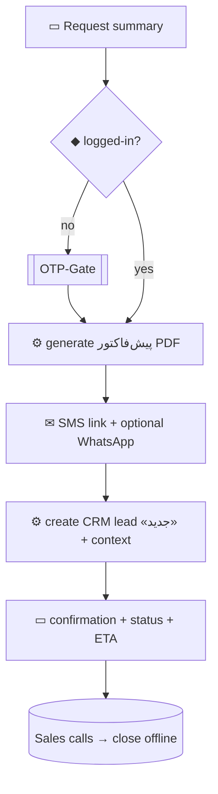

# Ahantime — UX Flows
## Layer 2 · Product Design — Document 7 of N

**Version:** 1.0 · 26 June 2026
**Status:** Draft for approval
**Builds on:** `user-stories.md`, `acceptance-criteria.md`, `user-prioritization.md`
**Purpose:** Define the end-to-end journeys users take — steps, decision points, branches, error/edge paths, and screen states — for the public site and the admin. Diagrams use **Mermaid** (renders on GitHub).

### Notation / legend
- **▭ Screen** · **◆ Decision** · **⚙ System/tool action** · **✉ Notification** · **◎ State** (loading/empty/error) · **➜ transition**
- **Reusable sub-flows** (defined once, referenced everywhere): **[OTP-Gate]**, **[Grounding-Fallback]**, **[Stale-Price]**, **[Channel-Handoff]**.
- **Maps to:** references to `US-*` (stories) and `AC-*` (acceptance criteria).

---

## 0. Experience Model & Navigation

Ahantime is a **funnel with two parallel lanes** (per User Prioritization):

- **Guided lane** (Builder/newcomer) → the **AI hero «آهن‌تایم»**.
- **Fast lane** (Pro/Trader) → the **fixed right-side category rail → price tables**.

Both lanes are reachable from every page; neither is forced.



**Global layout (every page):**
- **Top:** نبض بازار ticker → header (logo, nav, login/account, AI entry).
- **Center-top of home:** the AI search hero.
- **Right (fixed):** category rail (collapses to a control on mobile).
- **Footer:** trust (eNamad/Samandehi/اتحادیه), address/phones, channels, links.

**Entry points (where users arrive):**
| Entry | Typical persona | Lands on | First goal |
|---|---|---|---|
| SEO price page (قیمت میلگرد…) | Pro, Trader, Builder | SKU/category table | see price |
| "dollar/gold" search / direct | Price-Checker | ticker / طلا و ارز | check FX |
| AI / brand search | Builder | AI hero | get advice |
| Telegram/Instagram/Eitaa link | Trader, all | price page / home | prices/alerts |
| Direct / referral | all | home | explore |

---

## Reusable Sub-Flows

### [OTP-Gate]  *(maps US-G1, AC-F-2)*

- Draft is preserved on gateway failure (AC-F-2.4); never lose the user's request.

### [Grounding-Fallback]  *(maps AC-D-3/D-4)*

- **The AI never outputs an unvalidated/guessed number.**

### [Stale-Price]  *(maps AC-B-2.2)*
```
IF price age ≤ همان روز → show normally
ELSE IF age ≤ 2 روز کاری → show price + its real Jalali date (visible)
ELSE → hide number → show «تماس بگیرید» + ثبت درخواست CTA
```

### [Channel-Handoff]  *(maps US-F6, AC-K-2)*
User taps «ادامه در واتساپ/تلگرام» ➜ ⚙ build context (items/quote) ➜ open deep-link with prefilled summary ➜ lead records the channel.

---

## F1 · First-visit / Dual-mode Home  *(US-D1, US-B1; AC-A/B/D)*

**Goal:** orient any visitor in <5s and route them into the right lane.
**Steps:**
1. ▭ Home loads: ticker (top) + AI hero (center) + category rail (right) + trust strip.
2. ◆ What does the visitor do first?
   - Types in AI hero ➜ **F4 (AI guided)**.
   - Hovers/clicks a rail category ➜ **F3 (fast lane)**.
   - Looks at ticker / clicks طلا و ارز ➜ **F2 (price-checker)**.
   - Scrolls (Why us, mills, customers, featured prices, content) ➜ trust building ➜ back to a lane.
3. ◎ States: ticker stale (A-2), AI relay down (D-9) → AI shows graceful message + «ثبت درخواست».



---

## F2 · Price-Checker → Retain → Capture  *(US-A1/A2, US-C1; AC-A,C)*

**Goal:** keep the "just checking the dollar" visitor and capture identity.

- **Conversion idea realized:** FX page cross-links to «قیمت آهن امروز»; alerts require OTP → casual visitor becomes a known contact.

---

## F3 · Pro Fast-Lane: rail → table → inquiry  *(US-B1/2/8, US-F1; AC-B,F)*

**Goal:** let a Pro price and request in <2 minutes.
**Steps:**
1. ▭ Rail: hover category → name flips to image; click → ▭ price table.
2. ▭ Table: scan استاندارد/وزن/قیمت/نوسان/تاریخ/**زمان تحویل** + last-updated.
   - ◆ price fresh? → **[Stale-Price]** branch governs display.
3. Actions: filter/search, favorite (→ [OTP-Gate] if guest), chart, Excel/image/print, VAT/unit toggle.
4. Add one or more SKUs to **سبد استعلام** ➜ ▭ inquiry cart.
5. «ثبت درخواست» ➜ **F6 (Lead/Quote)**.



---

## F4 · Builder Guided-Lane: AI advisor  *(US-D2..D7, US-E2; AC-D)*

**Goal:** turn an unsure buyer into a confident, qualified lead.
**Steps (intent-first, mandatory):**
1. ▭ AI hero greets («سلام، من آهن‌تایمم…»), suggested chips shown.
2. User: «قیمت آهن چنده؟» ➜ ◆ bare price? → **AI asks purpose first** (AC-D-2), does **not** quote.
3. User: «می‌خوام ساختمون بسازم» ➜ AI gathers متراژ/طبقات/نوع سازه (asks targeted follow-ups if missing).
4. ⚙ estimateProject + calcWeight + getPrice ➜ **[Grounding-Fallback]** governs every number.
5. ▭ AI returns structured estimate: items + total weight + total cost (labeled تخمینی) + suggested chips.
6. ◆ user acts?
   - «دریافت پیش‌فاکتور/ثبت درخواست» ➜ carry BOM ➜ **F6**.
   - «گفتگو با کارشناس» ➜ createLead + callback.
   - asks more ➜ loop (memory retained).
7. ◎ relay down (D-9) → graceful message + «ثبت درخواست».



---

## F5 · AI Fast Lookup (Pro via AI)  *(US-D5)*
Precise query («قیمت میلگرد ۱۴ A3 ذوب آهن») ➜ ⚙ getPrice ➜ **[Grounding-Fallback]** ➜ grounded price + زمان تحویل + «ثبت درخواست» ➜ **F6**. No long chat.

---

## F6 · Lead / Quote Conversion (the spine)  *(US-F1..F6; AC-F)*

**Goal:** request → پیش‌فاکتور → CRM lead, traditionally closed, no payment.
**Steps:**
1. ▭ Request summary (items/BOM, qty, weight, est. total, VAT toggle).
2. ◆ logged-in? → no → **[OTP-Gate]**; yes → continue.
3. ⚙ generate **پیش‌فاکتور PDF** (logo/header, lines, weights, VAT, totals, ref #, Jalali date, validity countdown).
4. ✉ deliver via SMS link (+ optional WhatsApp via **[Channel-Handoff]**).
5. ⚙ create **CRM lead** (status «جدید») with full context (items, AI convo, source, contact, channel prefs).
6. ▭ confirmation: «درخواست ثبت شد؛ کارشناس تا … تماس می‌گیرد» + status + reorder later.
7. ◎ errors: SMS fail → retry, keep draft; PDF fail → retry, lead still created.



---

## F7 · Price Alert  *(US-C1/C2; AC-C)*
From a row/ticker item ➜ ▭ set rule (زیر/بالای + value) ➜ ◆ identified? → **[OTP-Gate]** ➜ ✅ saved.
Trigger: ⚙ price/value meets condition ➜ ✉ one notification (SMS/Telegram) ➜ alert marked triggered (no re-fire until reset). Failure → «ارسال ناموفق» in account.

---

## F8 · Tools: وزن‌سنج / پروژه‌سنج  *(US-E1/E2; AC-E)*
- **وزن‌سنج:** ▭ select product+dimensions+qty ➜ ⚙ formula ➜ ▭ weight; invalid input → inline error. Same engine as AI calcWeight.
- **پروژه‌سنج:** ▭ inputs (متراژ/طبقات/نوع سازه) ➜ ⚙ coefficients + getPrice ➜ ▭ material list + weight + cost (تخمینی) ➜ «ثبت درخواست» → **F6**.

---

## F9 · Account: login, favorites, history  *(US-G1..G3)*
Header «ورود» ➜ **[OTP-Gate]** ➜ ▭ account: favorites · request history (پیش‌فاکتورها) · alerts · profile. Each list has loading/empty/error states; reorder from a past request → **F6**.

---

## F10 · Customer Club join  *(US-H1/H2; AC-H)*
Trigger: user completes a quote or sets an alert ➜ ◆ member? no & not recently dismissed ➜ ▭ **intent-timed popup** «عضویت در باشگاه آهن‌تایم» (never on first load).
- Accept ➜ ◆ logged-in? → [OTP-Gate] ➜ ⚙ enroll ➜ ▭ tier (آهن/فولاد/پولاد) + benefits.
- Dismiss ➜ suppressed for 7 days.

---

## F11 · Content: read + (admin) AI draft → approve  *(US-I1/I2; AC-I)*
- **Reader:** ▭ news/blog list (Jalali) ➜ ▭ article (SSR, indexable) ➜ related prices/CTA.
- **Admin (CE):** ⚙ AI generates draft (grounded) ➜ ▭ approval queue «پیش‌نویس» ➜ ◆ CE edit/approve/schedule/reject ➜ publish only on approval (mandatory gate).

---

## F12 · Cooperation «همکاری با ما»  *(US-L1/L2; AC-L)*
▭ hub (تحلیل بازار / تأمین از شما / فروش از ما) ➜ select track ➜ ▭ form (validated) ➜ ⚙ create CRM lead **tagged by type** ➜ ▭ success state. Empty/error states defined.

---

## F13 · ADMIN — Daily Price Entry (Price Operator)  *(US-M1/M2; AC-M-1/2)* — the operational spine

**Goal:** publish a full day's prices fast, accurately, with stale-flagging.
**Steps:**
1. OP logs in (OTP, whitelisted) ➜ ▭ **Daily Price Grid** (all active SKUs, last price + last-update, **stale flags** on not-updated-today).
2. OP makes استعلام calls; enters قیمت + زمان تحویل per SKU (single or bulk; copy-yesterday/±%/Excel-paste).
3. ◆ valid? (price>0, delivery allowed) → invalid rows blocked with inline errors; valid rows save.
4. ⚙ on save: public table updates, **نوسان auto-computed**, **history appended**, audit-logged.
5. ▭ stale list shows remaining un-updated SKUs to finish.

```mermaid
flowchart TD
  L[OP login OTP] --> GRID[▭ Daily Price Grid + stale flags]
  GRID --> ENTER[enter قیمت + زمان تحویل (single/bulk)]
  ENTER --> VAL{◆ valid? price>0}
  VAL -- no --> ERR[◎ inline errors, block row] --> ENTER
  VAL -- yes --> SAVE[⚙ publish + auto نوسان + history + audit]
  SAVE --> STALE[▭ remaining stale list]
  STALE --> GRID
```
- **[Stale-Price]** governs how any still-stale SKU appears publicly.

---

## F14 · ADMIN — CRM Lead Handling (Sales)  *(US-F9, US-M4; AC-M-4)*
▭ Leads pipeline (جدید/در تماس/برنده/بازنده) ➜ open lead (full context: items, AI convo, weights, source) ➜ ◆ action: call (callback time), change status, add notes, schedule follow-up ➜ all changes audit-logged. Won/lost closes the loop.

---

## F15 · ADMIN — Content Approval (Editor)  *(US-M5; AC-M-5)*
▭ Draft queue ➜ open draft ➜ ◆ edit / approve / schedule / reject ➜ flagged price-claims highlighted ➜ publish only on approval.

---

## Cross-flow Interaction Patterns
- **State inventory (every data screen):** loading (skeleton) · empty (Persian + CTA) · error (Persian + retry, no English/stack) · partial/stale (visible indicator).
- **OTP is a single reusable gate** — invoked by favorites, alerts, requests, club, account.
- **The lead is the universal exit** — fast lane, AI, tools, cooperation, and «تماس بگیرید» all converge on **F6**.
- **No dead-ends:** every "no price / no data / error" path offers a request/callback, never a blank stop.
- **Handoffs** (WhatsApp/Telegram/Eitaa) preserve context.

---

## Flow → Story/AC coverage
| Flow | Stories | AC |
|---|---|---|
| F1 Home dual-mode | US-D1,B1 | AC-A,B,D |
| F2 Price-checker | US-A1,A2,C1 | AC-A,C |
| F3 Pro fast-lane | US-B1,B2,B8,F1 | AC-B,F |
| F4 AI guided | US-D2–D7,E2 | AC-D |
| F5 AI fast lookup | US-D5 | AC-D |
| F6 Lead/Quote | US-F1–F6 | AC-F |
| F7 Alert | US-C1,C2 | AC-C |
| F8 Tools | US-E1,E2 | AC-E |
| F9 Account | US-G1–G3 | AC-G |
| F10 Club | US-H1,H2 | AC-H |
| F11 Content | US-I1,I2 | AC-I |
| F12 Cooperation | US-L1,L2 | AC-L |
| F13 Admin pricing | US-M1,M2 | AC-M-1,2 |
| F14 Admin CRM | US-M4 | AC-M-4 |
| F15 Admin content | US-M5 | AC-M-5 |

*Next Layer-2 document: Information Architecture & Sitemap (these flows become concrete pages/routes), then Wireframes.*

*Ahantime — اول مشورت، بعد خرید.*
